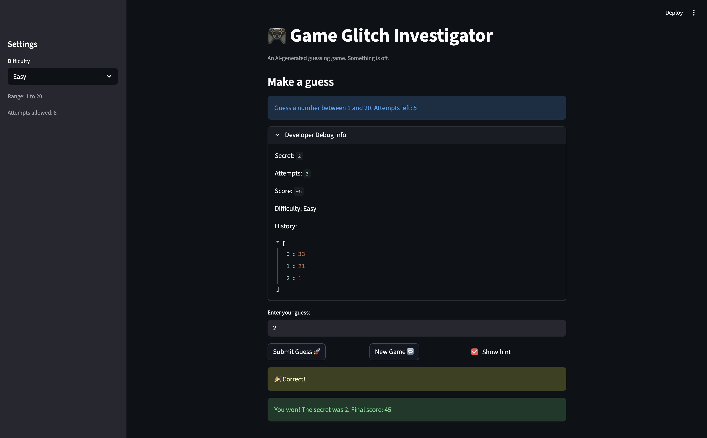

# 🎮 Game Glitch Investigator: The Impossible Guesser

## 🚨 The Situation

You asked an AI to build a simple "Number Guessing Game" using Streamlit.
It wrote the code, ran away, and now the game is unplayable. 

- You can't win.
- The hints lie to you.
- The secret number seems to have commitment issues.

## 🛠️ Setup

1. Install dependencies: `pip install -r requirements.txt`
2. Run the broken app: `python -m streamlit run app.py`

## 🕵️‍♂️ Your Mission

1. **Play the game.** Open the "Developer Debug Info" tab in the app to see the secret number. Try to win.
2. **Find the State Bug.** Why does the secret number change every time you click "Submit"? Ask ChatGPT: *"How do I keep a variable from resetting in Streamlit when I click a button?"*
3. **Fix the Logic.** The hints ("Higher/Lower") are wrong. Fix them.
4. **Refactor & Test.** - Move the logic into `logic_utils.py`.
   - Run `pytest` in your terminal.
   - Keep fixing until all tests pass!

## 📝 Document Your Experience

- [ ] Describe the game's purpose.
This is a number-guessing challenge game where the player tries to find a secret number within a selected difficulty range using limited attempts, hints, and a running score.
- [ ] Detail which bugs you found.
I found four main bugs: difficulty ranges were inconsistent (Normal and Hard were swapped), hint directions were reversed (higher/lower messages were opposite), New Game sometimes prevented proper next-round submission flow, and secret number generation was not always aligned with the selected difficulty.
- [ ] Explain what fixes you applied.
I fixed the difficulty mapping so ranges progress correctly (Easy 1-20, Normal 1-50, Hard 1-100), corrected hint messages to match guess outcomes, updated New Game reset state (attempts/status/history) so rounds restart cleanly, and ensured secret generation uses the active difficulty bounds instead of a hardcoded range.

## 📸 Demo

- [ ] 

## 🚀 Stretch Features

- [ ] 
